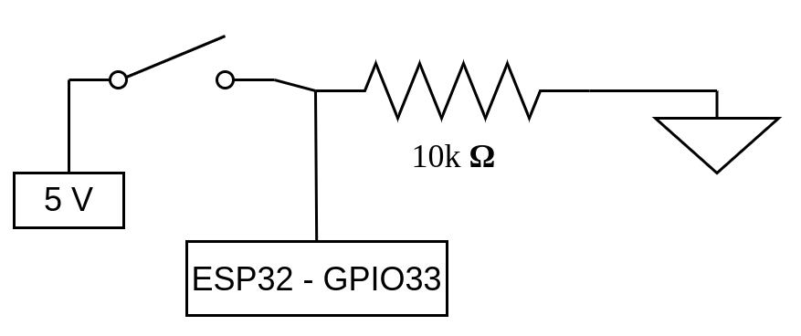

# Construye tu propio bleskomat DIY

Este tutorial te enseñara lo básico sobre como construir tu propio Bleskomat-diy que podrás usar para ayudar a recien llegados a Bitcoin a adquirir sus primeros sats usando red relampago de Bitcoin (Lightning Network).

## Principales caracteristicas del cajero Bleskomat

Bleskomat-diy es un proyecto de codigo libre para construir un cajero de Bitcoin utilizando la red relampago (Lightning Network).
* Funciona sin conexión a internet (no necesita ningún tipo de conexion a internet)
* Económico y con componentes que son faciles de conseguir
* Facil de "hackear" y extender

El cajero bleskomat debe ir acompañado de bleskomat-server (https://github.com/samotari/bleskomat-server) el cual se encarga de gestionar los pagos en la red relámpago para uno o más cajeros.

## Requerimientos de hardware
Componentes necesarios para contruir tu propio cajero bleskomat-diy:

* Cables con conectores dupon macho-macho
* Cables con conectores dupon macho-hembra
* Placa de desarrollo ESP32
* Aceptor de monedas hx616
* Pantalla TFT 1.8"
* Botón
* Resistencia de 10k ohm
* Adaptor de corriente continua
* Transformador de corriente continua 12V y ~1A
* Cable USB - micro USB
* Multímetro
* XL4005 regulador de voltaje + adaptador USB (F)

> Componentes opcionales

* Soldador


## Requisitos de software
* Make (https://www.gnu.org/software/make/)
* PlatformIO Core (https://docs.platformio.org/en/latest/core/)
  * Verison 5 o más reciente
  * Solo CLI ("core") es necesario

## Contruir el dispositivo físco
Una vez que has adquirido todos los componentes de hardware y software puedes empezar a construir tu propio bleskomat-diy.


### Flash firmware al ESP32
La forma más facil de flashear el firmware es usando la herramienta de flasheado de la plataforma bleskomat https://platform.bleskomat.com/serial.

La placa de desarrollo ESP32 tienen muchos pins pero solo usaremos algunos de ellos. En la imagen abajo puedes ver todos los que tienen una de las versiones de placas de desarrollo mas comunes.


Dependiendo de tu proveedor la colocación de los pins puede ser diferente asi que es recomendable seguir los nombres de los pins en lugar de la ubicación en las imagenes de este tutorial.

### Fuente de alimentación

El primer paso para la construcción del dispositivo es connectar lo que será la fuente de alimentación.
1) Conectar el adaptador de 12V al connector jack barrel
2) Conectar jack barrel a red de 12V para tener 2 salidas (regulador de voltaje y aceptor de monedas)
3) Crear una red de tierra
4) Conectar al regulador de voltaje y configurarlo

### Conectar ESP32 con regulador de voltaje (5V)

### Conectar la pantalla TFT

Conecta el módulo con la pantalla TFT a la placa de pruebas. La imagen abajo te da una idea de como la puedes situar para facilmente poderla conectar a la placa de desarrollo ESP32.

<!--  -->

La tábla abajo contiene los nombres con los pins de la patalla que tienen que ir conectados al ESP32. Algunos pins tienen un nombre entre parentesis, eso es debibo a que algunos proveedores de placas de desarrollo ESP32 los llaman de una manera y otros de la otra.

Algunos de los pins que en la tabla son llamados `GPIOxx` en tu placa de desarrollo pueden estar marcados como `Dxx`.

|  ESP32       | TFT         |
|--------------|-------------|
| VIN (V5)     | VCC         |
| GND          | GND         |
| GPIO22       | CS          |
| GPIO4        | RESET (RST) |
| GPIO2        | AO (RS)     |
| GPIO23       | SDA         |
| GPIO18       | SCK (CLK)   |


<!-- 
 -->

### Conectar el botón

Conecta el botón donde creas que es mas practico, normalmente en alguna de las esquinas de las placas de pruebas para poder acceder y presionarlo sin tener muchos cables por medio.



| ESP32    | Botón         |
|----------|---------------|
| VIN (V5) | pin izquierdo |
| GPIO33   | pin derecho   |

Conecta el pin derecho del boton a la toma de tierra (GND) con una resistencia de 10k ohm tal y como figura en la imagen abajo.

<!--  -->


### Conectar el aceptor de monedas (hx616)

El aceptor de monedas DG600F funciona con comunicación serie y hay que conectarlo a la alimentación de 12V de corriente contínua.

| ESP32       | HX-616   | Alimentación  |
|-------------|----------|---------------|
|             | DC12V    | + 12V DC      |
| GPIO3 (RX0) | COIN     |               |
|             | GND      | - Ground      |


Si has llegado hasta aqui, ya tienes todos los cables conectados. Ahora tenemos que configurar el dispositivo.


## Configuración y entrenamiento del aceptor de monedas (hx616)

El aceptor de monedas hx616 tiene en el lateral unos botones


## Configurar Bleskomat

* `apiKey.id` - La identificación de tu Bleskomat-DIY. Esto es necesario para que el servidor pueda comprobar que las firmas han sido creadas por el dispositivo.
* `apiKey.key` - Es la llave secreta que va a ser usada para generar las firmas digitales.
* `apiKey.encoding` - Este parametro indica el tipo de codificacion de la  "apiKey.key". Pueder ser "hex", "base64" o "" para indicar que no esta codificada.
* `callbackUrl` - La URL junto con la ruta que uses en tu Servidor Bleskomat. Por ejemplo `https://your-bleskomat-server.com/u`
* `shorten` - Para indicar si usas parámetros de LNURL acortados para ahorrar espacio en la URL y asi tener codigos QR mas claros. Para más informacion [lnurl-node module](https://github.com/chill117/lnurl-node#signed-lnurls).
* `uriSchemaPrefix` - LIGHTNING - prefijo para que sea identificado por monederos de LN
* `fiatCurrency` - El simbolo de la divisa fiat que quieras utilizar. Puedes usar los simbolos tal y como en el estandar [ISO 4217](https://en.wikipedia.org/wiki/ISO_4217).
* `fiatPrecision` - El número de digitos a la derecha de la coma decimal, utilizado para mostrar más o menos digitos al usuario.
* `coinValueIncrement` - El acceptor de monedas hx616 se comunica mediante pulsos con el ESP32. El valor que aqui se determina cuanto valor va a tener cada pulso. Por ejemplo para monedas de EUR el valor podría ser `0.05` con el siguiente numero de pulsos para cada denominación:

	* 0.05 EUR = 1 pulsos
	* 0.10 EUR = 2 pulsos
	* 0.20 EUR = 4 pulsos
	* 0.50 EUR = 10 pulsos
	* 1.00 EUR = 20 pulsos
	* 2.00 EUR = 40 pulsos

### Con tarjeta SD
La pantalla TFT dispone de un lector de tarjetas micro SD. Los pins deberian ir soldados y luego conectados al ESP32. Las conexiones deben ir tal y como figuran en la tabla abjo:

| ESP32  | TFT     |
|--------|---------|
| GPIO15 | SD_CS   |
| GPIO13 | SD_MOSI |
| GPIO12 | SD_MISO |
| GPIO14 | SD_SCK  |

La tarjeta debe estar formateada para sistema de archivos FAT.

Crea un nuevo archivo con nombre `bleskomat.conf` en la raiz de la tarjeta SD.

Un ejemplo de datos que debe contener el archivo `bleskomat.conf`:
```
apiKey.id=6d830ddeb0
apiKey.key=b11cd6b002916691ccf3097eee3b49e51759225704dde88ecfced76ad95324c9
apiKey.encoding=hex
callbackUrl=https://your-bleskomat-server/u
shorten=true
uriSchemaPrefix=
fiatCurrency=EUR
fiatPrecision=2
coinValueIncrement=0.05
```

### Configuración directamente en el código

Puedes cambiar los valores para configurar Bleskomat-DIY directamente en el código si vas al archivo [config.cpp](https://github.com/samotari/bleskomat-diy/blob/master/src/config.cpp#L152-L162).

Esta opción te obliga a compilar y subir el nuevo firmware a tu microcontrolador cada vez que modifiques algun atributo.